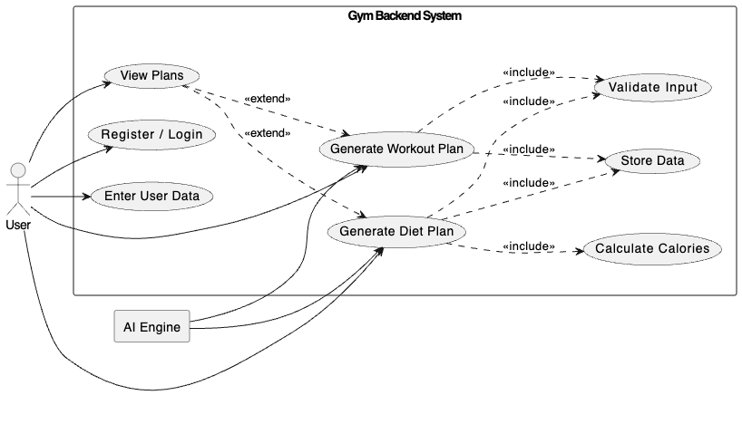
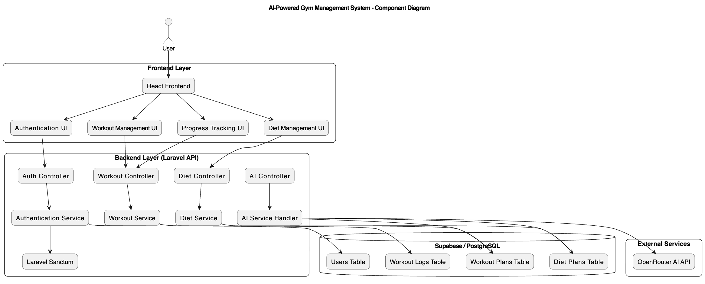
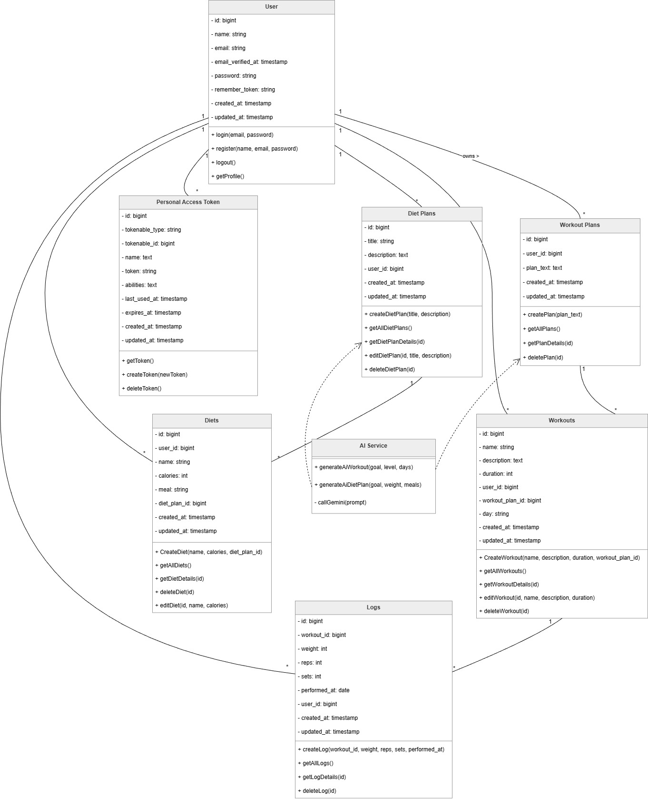
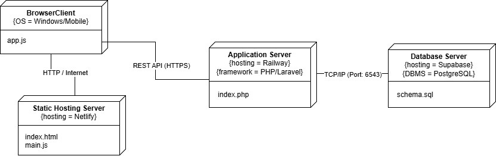
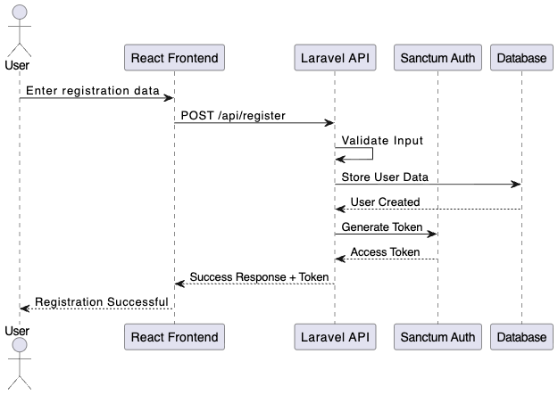
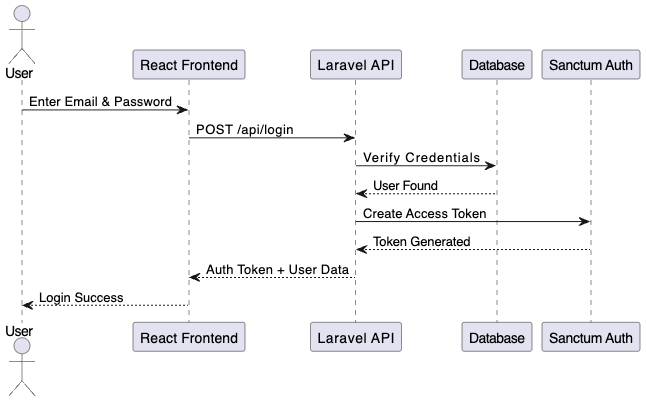
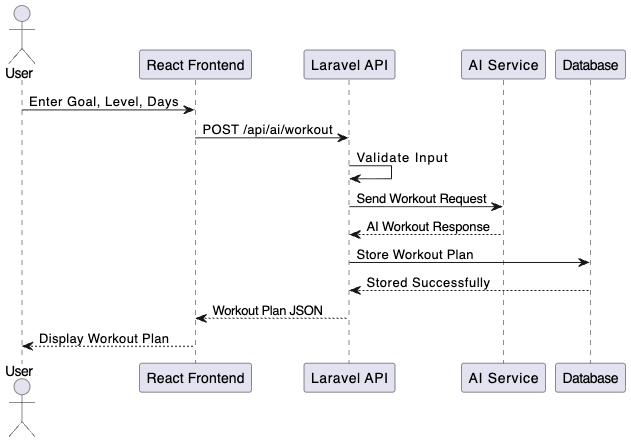
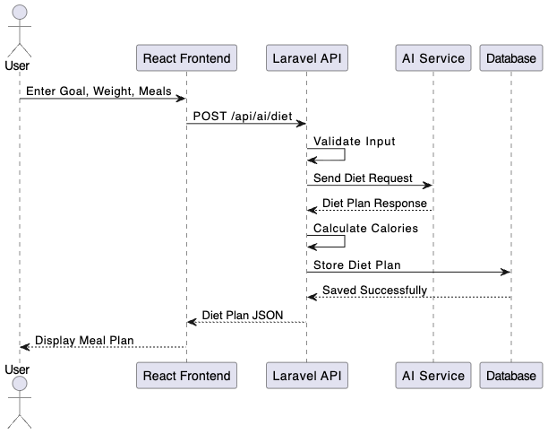
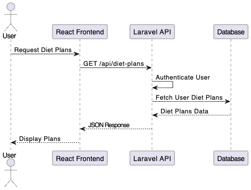
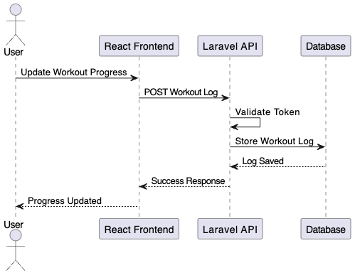

# 🏋️ AI-Powered Gym Backend API (Laravel)

Designed for scalability, clean architecture, and real-world API usage.

A RESTful backend system for a fitness application that allows users to manage workouts, track progress, and generate AI-powered workout and diet plans using AI APIs.

---

# 📌 Project Overview

This project is a scalable RESTful backend API developed using Laravel for a modern AI-powered fitness application.

The system enables users to:

- Generate AI workout plans
- Generate AI diet plans
- Track workout progress
- Manage workout logs
- Access personalized fitness recommendations
- Securely authenticate using token-based authentication

This project was developed as part of the **System Design and Analysis** course.

---

# 🚀 Features

- RESTful API architecture
- AI Workout Generator
- AI Diet Generator
- Workout progress tracking
- Secure authentication using Laravel Sanctum
- Clean JSON responses optimized for frontend/mobile integration
- Modular backend structure
- Database-driven plan management

---

# 🛠️ Tech Stack

- Laravel
- React
- SQLite (initially)
- Supabase PostgreSQL
- Laravel Sanctum
- OpenRouter AI API
- REST API Architecture

---

# 🔐 Authentication & Security

- Token-based authentication using Laravel Sanctum
- Protected API endpoints
- User authorization checks
- Secure user data isolation
- Authenticated request validation

---

# 🗄️ Database Structure

## Main Tables

- Users
- Workouts
- Workout Logs
- Workout Plans
- Diet Plans

## Relationships

- User → Workouts
- User → Workout Logs
- User → Workout Plans
- User → Diet Plans

---

# 📊 System Design



👉 [View Full Diagram](Docs/System-Design.drawio.pdf)

---

# 🧩 Component Diagram


👉 [View Full Diagram](Docs/Component_diagram.drawio.png)

---

# 🧩 Class Diagram



👉 [View Full Diagram](Docs/back-end_Class-Diagram.pdf)

---

# 🏗️ Deployment Diagram

This deployment diagram illustrates the communication between the frontend client, hosting services, Laravel backend server, and Supabase database.



---

# 🔄 Sequence Diagrams

## 1️⃣ User Registration Sequence

Illustrates the registration workflow using Laravel Sanctum authentication.



---

## 2️⃣ User Login Sequence

Shows how users authenticate and receive access tokens.



---

## 3️⃣ AI Workout Generation Sequence

Demonstrates how the system generates personalized workout plans using AI services.



---

## 4️⃣ AI Diet Plan Generation Sequence

Illustrates the AI-powered diet generation workflow and calories calculation process.



---

## 5️⃣ View Diet Plans Sequence

Shows how authenticated users retrieve stored diet plans from the database.



---

## 6️⃣ Workout Progress Tracking Sequence

Illustrates workout logging and progress tracking workflow.



---

# 💪 Workout Management

The system supports:

- Create workouts
- Update workouts
- Delete workouts
- Group workouts by day
- Track workout performance
- Store workout logs

---

# 🧠 AI Workout Generator

Generate workout plans dynamically based on:

- Goal
- Fitness level
- Number of workout days

### Features

✔ Personalized recommendations  
✔ Organized by workout day  
✔ Stored in database  
✔ AI-generated responses  

---

# 🥗 AI Diet Generator

Generate AI-powered meal plans based on:

- Goal
- Weight
- Number of meals

### Features

✔ Calories calculation  
✔ Meal grouping  
✔ Personalized recommendations  
✔ Stored in database  

---

# 📦 Example JSON Response

```json
{
  "Breakfast": {
    "foods": [
      { "name": "Oats", "calories": 300 },
      { "name": "Banana", "calories": 100 }
    ],
    "total_calories": 400
  }
}
```

---

# 📡 API Endpoints

## Authentication

- POST `/api/register`
- POST `/api/login`

## AI Endpoints

- POST `/api/ai/workout`
- POST `/api/ai/diet`

## Diet Plans

- GET `/api/diet-plans`
- GET `/api/diet-plans/{id}`

---

# ⚙️ Installation

```bash
git clone https://github.com/Siry001/project_backend.git
cd gym-backend
composer install
```

```bash
cp .env.example .env
php artisan key:generate
php artisan migrate
```

---

# 🔑 Environment Variables

```env
OPENROUTER_API_KEY=your_api_key_here
```

---

# ▶️ Run Server

```bash
php artisan serve
```

---

# 📱 Future Improvements

- Flutter mobile application
- Real-time analytics dashboard
- AI chatbot fitness assistant
- Exercise video integration
- Smart recommendation engine
- Subscription & payment system

---

# 👨‍💻 Author
## siry
