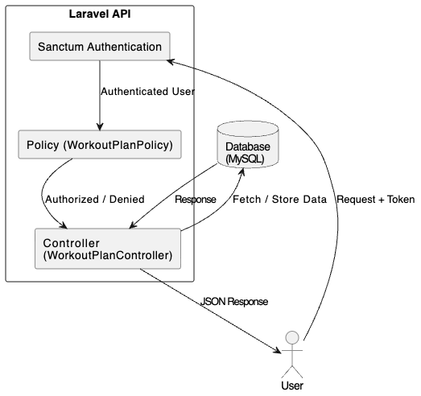
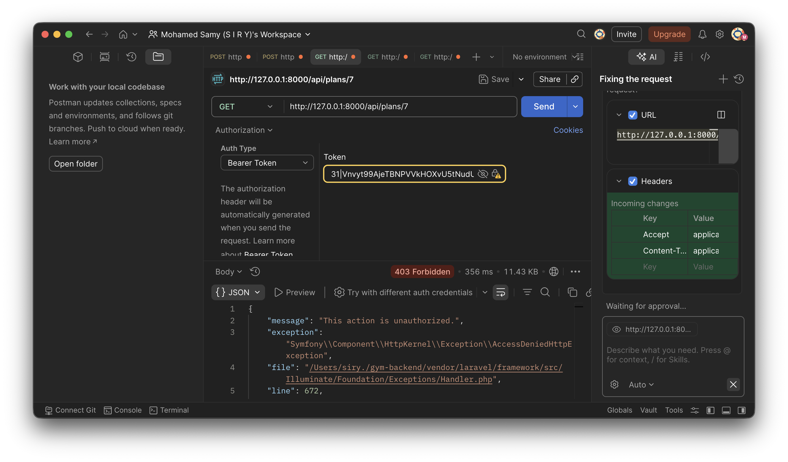

# 📌 Gym Backend API - Authorization System

A secure RESTful API built with Laravel, implementing authentication with Sanctum and authorization using Policies.


## 📖 Project Overview

This project is a RESTful backend for a Gym Management System built using Laravel.
It includes authentication, workout plans, and authorization using Laravel Policies.

---

## 🏗 Architecture Diagram

<p align="center">
  
</p>
---

## 🚀 Getting Started

```bash
git clone https://github.com/Siry001/project_backend.git
cd project_backend

composer install
cp .env.example .env
php artisan key:generate

php artisan migrate

php artisan serve
```

---

## 📁 Project Structure
```bash
app/
 ├── Models/
 │   ├── User.php
 │   └── WorkoutPlan.php
 │
 ├── Policies/
 │   └── WorkoutPlanPolicy.php
 │
 ├── Http/
 │   └── Controllers/
 │       └── WorkoutPlanController.php
 │
 └── Providers/
     └── AuthServiceProvider.php

routes/
 └── api.php

database/
 └── migrations/

config/
 └── sanctum.php
```
---

## 🔐 Authentication

Authentication is implemented using Laravel Sanctum, enabling secure token-based access.

### Features

- User Registration  
- User Login  
- API Token Generation  
- Protected routes using middleware  

---

## 🧠 Authorization (Core Feature)

Authorization is implemented using Laravel Policies to enforce ownership-based access control.

Each user is only allowed to access and manage their own workout plans.


## 🎯 Objective

Ensure that each authenticated user can only:
-	Access their own workout plans
-	Modify or delete only their own data

---

## 🏗 System Implementation


### 1. Policy Creation

```
php artisan make:policy WorkoutPlanPolicy --model=WorkoutPlan
```


### 2. Authorization Logic
```
public function view(User $user, WorkoutPlan $workoutPlan): bool
{
    return $user->id === $workoutPlan->user_id;
}
```


### 3. Policy Registration

Policies are registered inside:
```
app/Providers/AuthServiceProvider.php
```
```
protected $policies = [
    WorkoutPlan::class => WorkoutPlanPolicy::class,
];
```


### 4. Controller Protection
```
public function __construct()
{
    $this->authorizeResource(WorkoutPlan::class, 'plan');
}
```
⚠️ Important: The parameter name (plan) must match the route parameter.


### 5. Routes Protection
```
Route::middleware('auth:sanctum')->group(function () {
    Route::apiResource('plans', WorkoutPlanController::class);
});
```


## ⚠️ Issues Faced & Solutions

### ❌ Issue 1: 403 Unauthorized (with valid token)
- Cause: Policy was not properly registered
- Solution: Registered policy in AuthServiceProvider

⸻

### ❌ Issue 2: Authorization not triggered
- Cause: Incorrect parameter name in authorizeResource
- Solution:
```
'workoutPlan' ❌
'plan' ✅
```

### ❌ Issue 3: Debugging Authorization Flow
- Solution: Used dd() inside the policy to confirm execution

---

## 🧪 Testing

Testing was performed using Postman.

✔ Valid Scenario
-	Authenticated user requests their own workout plan → 200 OK

---

## ❌ Invalid Scenario
-	User requests another user’s workout plan
→ 403 Forbidden

---


## 📸 API Screenshots

### ✔ Create Plan (201 Created)


---

### ✔ Authorized Request (200 OK)


---

### ❌ Unauthorized Request (403 Forbidden)


---

## 🚀 Final Result
-	Secure and scalable API architecture
-	Proper implementation of Laravel Policies
-	Clean separation between authentication and authorization
-	Fully protected RESTful endpoints

---

## 🧩 Technologies Used
-	Laravel
-	Laravel Sanctum
-	MySQL
-	Postman
