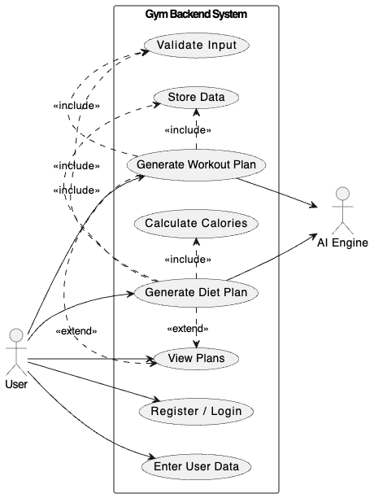

# 🏋️ Gym Backend API (Laravel)

Designed for scalability, clean architecture, and real-world API usage.
A RESTful backend system for a fitness application that allows users to manage workouts, track progress, and generate AI-powered workout and diet plans.

---

## 📌 Project Overview

A RESTful backend API built with Laravel for a fitness application that manages workouts, tracks progress, and generates AI-powered workout and diet plans.

This project was developed as part of a System Analysis course.

---

## 📊 System Design



👉 [View Full Diagram](Docs/System-Design.drawio.pdf)

---

## 🚀 Features

- RESTful API ready for mobile integration
- Clean JSON structure optimized for mobile apps
- AI Workout Generator
- AI Diet Generator
- Progress tracking system

---

## 🔐 Authentication & Security

- Authentication using Laravel Sanctum
- Token-based authentication
- Users can only access their own data
- Authorization checks on all endpoints

---

## 🗄️ Database Structure

Main tables:
- Users
- Workouts
- Workout Logs
- Workout Plans
- Diet Plans

Relationships:  
User → Workouts → Logs  
User → Workout Plans  
User → Diet Plans  

---

## 💪 Workouts

- Create, update, delete workouts
- Track workout progress
- Group workouts by day

---

## 🧠 AI Workout Generator

Generate workout plans based on:
- Goal
- Level
- Number of days

✔ Stored in database  
✔ Grouped by day  

---

## 🥗 AI Diet Generator

Generate diet plans based on:
- Goal
- Weight
- Number of meals

✔ Stored in database  
✔ Grouped by meals  
✔ Includes calories  

### Example Response

```json
{
  "Breakfast": {
    "foods": [
      { "name": "Oats", "calories": 300 },
      { "name": "Banana", "calories": 100 }
    ],
    "total_calories": 400
  }
}
```

## 🛠️ Tech Stack
-	Laravel
-	SQLite (switched to Supabase)
-	Laravel Sanctum
-	OpenRouter AI API

## ⚙️ Installation

```
git clone https://github.com/Siry001/project_backend.git
cd gym-backend
composer install
```
cp .env.example .env
```
php artisan key:generate
php artisan migrate
```

## 🔑 Environment Variables

```
OPENROUTER_API_KEY=your_api_key_here
```

## ▶️ Run Server

```
php artisan serve
```

## 📡 API Endpoints

### Auth
-	POST /api/register
-	POST /api/login

### AI
-	POST /api/ai/workout
-	POST /api/ai/diet

### Diet Plans
-	GET /api/diet-plans
-	GET /api/diet-plans/{id}

---

## 📱 Next Step

Frontend mobile app using Flutter.

---

## 👨‍💻 Author

Siry - Backend Developer
